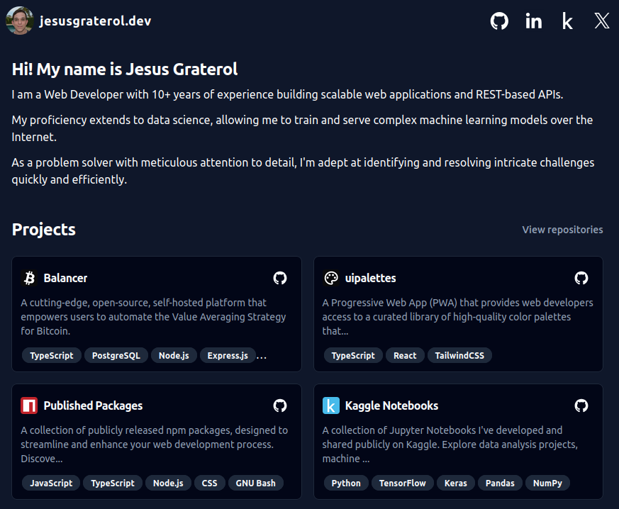

This repository contains the source code for my personal website, designed to showcase my skills and experience as a full-stack web developer and data scientist. The technologies used to build it are:

- Vite
- HTML
- CSS
- Tailwind CSS
- TypeScript
- React
- shadcn


<br/>

## Live Demo

[https://jesusgraterol.dev/](https://jesusgraterol.dev/)


<br/>

## Getting Started

### Requirements

- GIT
- NodeJS ^v22.3.0
- NPM ^v10.8.1

### Installation

Clone the repository

```bash
git clone git@github.com:jesusgraterol/jesusgraterol.dev.git
```

Install the dependencies

```bash
npm install
```


<br/>

## Usage

Start the development server by running:

```bash
npm run dev
```

Open `http://localhost:5173/` (the port may vary) with your favorite browser.


<br/>

## Build

Generate the production build by running:

```bash
npm run build
```


<br/>

## Deployment

When a commit is pushed to the `main` branch, **Github Workflows** automatically pushes the new
distribution to **Firebase Hosting**.


<br/>

## Running the Tests

```bash
# Unit Tests
$ npm run test:unit

# Integration Tests
$ npm run test:integration

# E2E Tests
$ npm run test:e2e
```


<br/>

## @TODO

- ...


<br/>

## License

[MIT](https://choosealicense.com/licenses/mit/)
